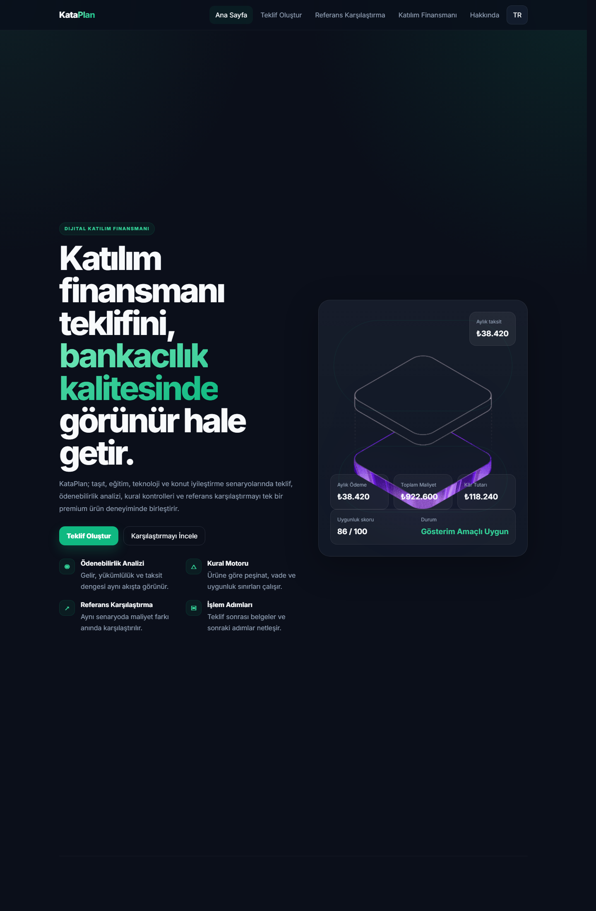
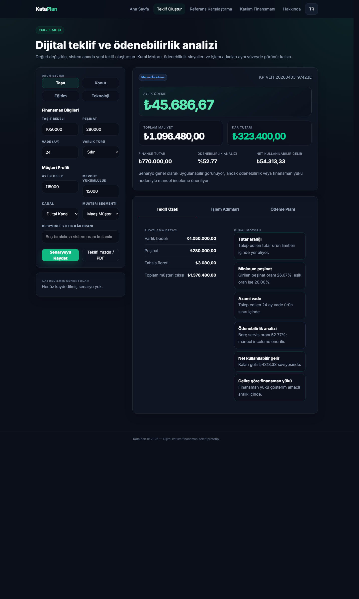
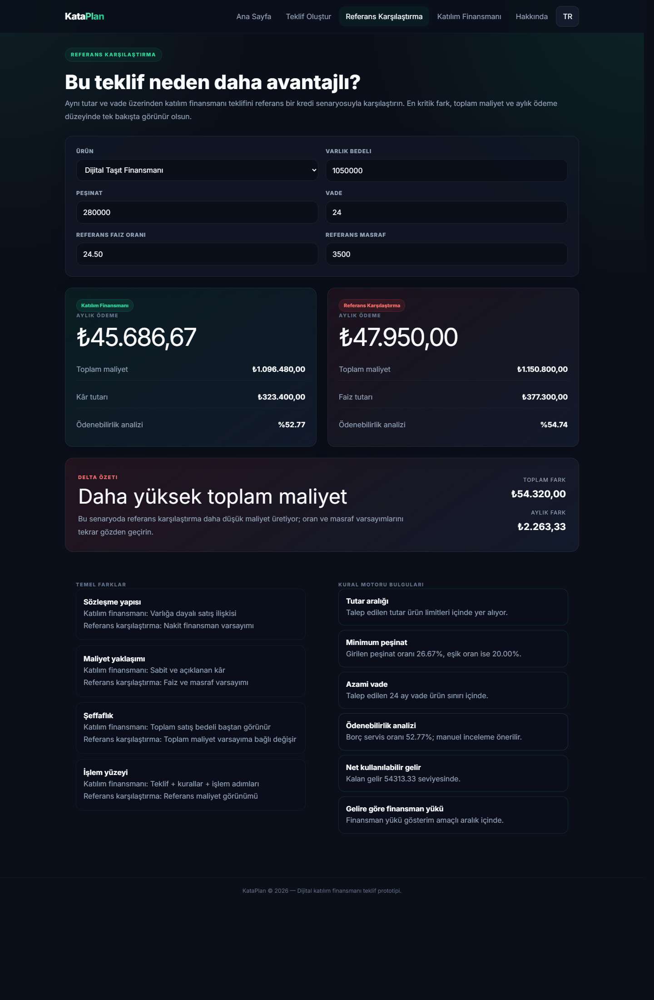

# KataPlan

KataPlan is a portfolio-grade participation finance prototype that models a digital pre-application journey instead of a single financing calculator.

It focuses on Murabaha-style pricing with:

- product-based policy rules
- affordability and eligibility signals
- transparent cost breakdowns
- document checklist and next-step guidance
- reference comparison against a conventional scenario
- saved scenarios and printable quote output
- OpenAPI-visible backend endpoints

## Product Highlights

- Quote flow: Generate an indicative participation finance offer with live pricing, policy checks, and payment schedule.
- Comparison flow: Compare the same scenario against a reference conventional financing benchmark.
- Product education: Explain how Murabaha pricing, rule visibility, and affordability logic are represented in the product.
- Multi-product support: Vehicle, home improvement, education, and technology purchase scenarios.

## Screenshots

### Home



### Quote Flow



### Reference Comparison



## Tech Stack

### Frontend

- React 19
- Vite
- React Router
- Axios
- Tailwind CSS v4

### Backend

- Python
- Flask
- Flask-CORS
- Python `decimal`

### Quality

- Python `unittest`
- OpenAPI JSON endpoint
- Vite PWA plugin

## API Surface

### `GET /api/health`

Simple health check.

### `GET /api/products`

Returns supported products, defaults, policy hints, channels, and customer segment options.

### `POST /api/calculate`

Generates an indicative quote.

Example payload:

```json
{
  "product_type": "vehicle",
  "asset_condition": "new",
  "asset_price": 950000,
  "down_payment": 250000,
  "months": 24,
  "monthly_income": 135000,
  "existing_commitments": 10000,
  "channel": "mobile",
  "customer_segment": "salary"
}
```

### `GET /api/openapi.json`

Returns a lightweight OpenAPI document for the current API contract.

## Project Structure

```text
Kataplan/
├── backend/
│   ├── app.py
│   ├── logic.py
│   ├── requirements.txt
│   ├── run_server.py
│   └── test_api.py
├── docs/
│   ├── hesapla.png
│   ├── home.png
│   └── karsilastir.png
├── frontend/
│   ├── src/
│   │   ├── components/
│   │   ├── lib/
│   │   └── pages/
│   ├── package.json
│   └── vite.config.js
├── dev.ps1
└── README.md
```

## Local Setup

### One-Command Dev Start (Windows PowerShell)

From the project root:

```powershell
.\dev.ps1
```

This starts the managed backend and frontend dev servers and verifies:

- frontend at `http://localhost:5173`
- backend health at `http://127.0.0.1:5000/api/health`

Useful commands:

```powershell
.\dev.ps1 -Status
.\dev.ps1 -Stop
```

### Manual Backend Setup

```bash
cd backend
python -m venv .venv
.venv\Scripts\activate
pip install -r requirements.txt
python app.py
```

### Manual Frontend Setup

```bash
cd frontend
npm install
npm run dev
```

## Test

From the project root:

```bash
.\.venv\Scripts\python.exe -m unittest backend.test_api
cd frontend && npm run build
```

## Notes

- This project is educational and portfolio-oriented.
- It does not replace real credit, compliance, or allocation systems.
- It is designed to demonstrate product thinking and engineering quality for participation finance use cases.
